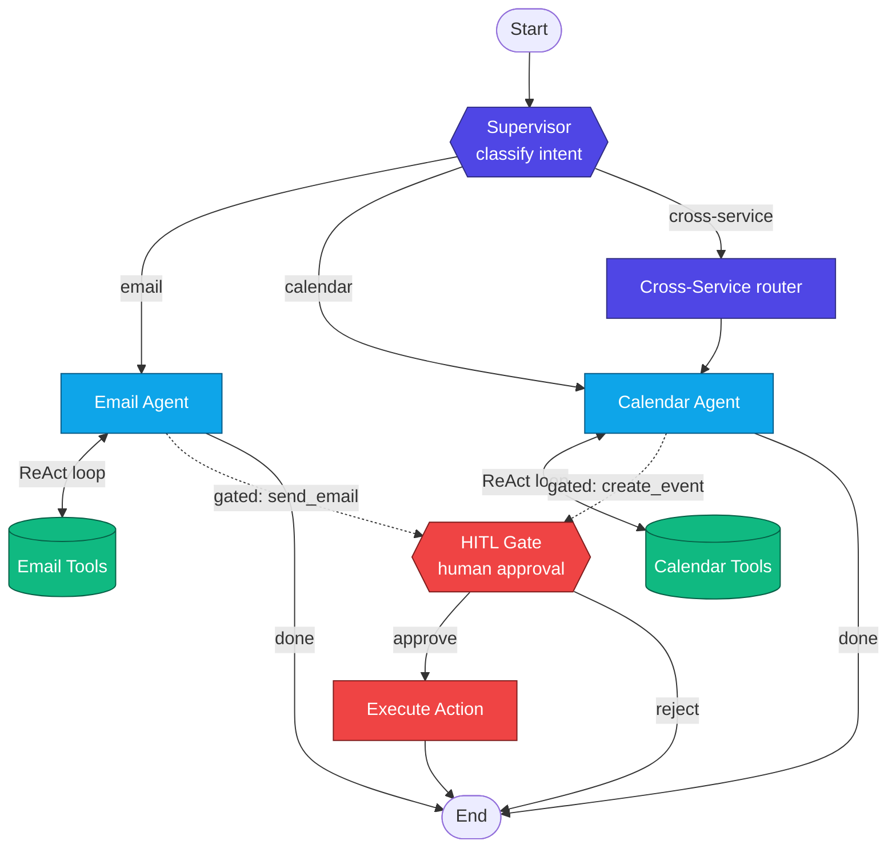

# Architecture

The demo is a LangGraph `StateGraph`. Each box below is a node; the supervisor
and the cross-service node route dynamically at runtime via `Command(goto=...)`.

This diagram renders on GitHub and in most Markdown previewers. A styled static
version is in `architecture.html`; to regenerate it from the live compiled graph
run `python3 src/assistant.py --graph` (writes `graph.live.html`).

## Nodes

| Node | Role |
|---|---|
| `supervisor` | Classifies intent, routes via `Command(goto=...)`. |
| `email_agent` | ReAct loop with email tools; can *propose* `send_email`. |
| `calendar_agent` | ReAct loop with calendar tools; can *propose* `create_event`. |
| `cross_service` | Routing node (no tools): calendar first, then email. |
| `email_tools` / `calendar_tools` | `ToolNode`s that execute ungated tool calls. |
| `hitl_gate` | Pauses with `interrupt()` for human approval. |
| `execute_action` | Fires the gated tool after approval. |

## State (shared across nodes)

| Field | Holds |
|---|---|
| `messages` | Conversation history (`add_messages` reducer). |
| `intent` | `email` / `calendar` / `cross_service`. |
| `pending_action` | The gated tool call awaiting approval. |
| `hitl_decision` | `approve` / `reject`. |

## Tools

**Email** — `list_messages`, `create_draft`, `label_message`, and the gated
`send_email`.
**Calendar** — `list_events`, `suggest_time`, and the gated `create_event`.

Tools are in-memory stubs so the demo runs without external services. Swapping
them for real Gmail/Calendar clients only requires changing the tool bodies.

## How this maps to the survey

- **Architecture** — supervisor + specialist sub-agents with tool loops.
- **Privacy / safety** — the HITL gate ensures no destructive action fires
  without explicit human approval.
- **Statefulness** — checkpointing lets the graph pause at the gate and resume.
